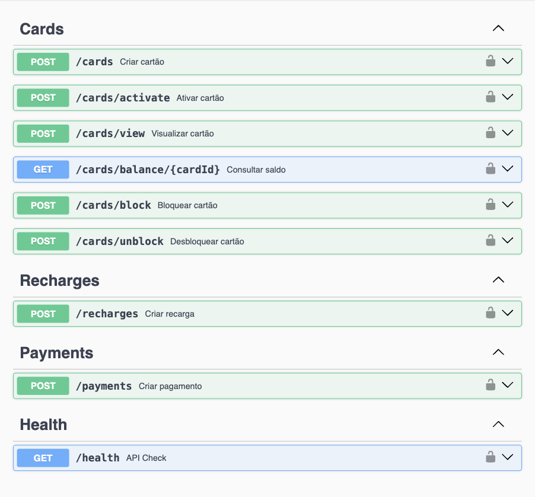

<p align="center"></p>

# <p align="center">Valex</p>

### <p align="center">API para Gerenciamento de Cartões Corporativos</p>

<div align="center">
   
   
   
   
    
    
   
   
   
   
   
</div>

## :clipboard: Descrição

O **Valex** é uma API para gerenciamento de cartões corporativos que permite às empresas oferecer benefícios flexíveis aos seus funcionários. A solução implementa um sistema completo de cartões de benefícios com diferentes categorias (alimentação, restaurante, transporte, educação e saúde), proporcionando controle total sobre o uso dos recursos corporativos.

## 🎯 **Principais Funcionalidades:**

- **Gestão Corporativa**: Empresas podem criar e gerenciar cartões para seus funcionários
- **Segurança Avançada**: Sistema de ativação com senha e código de segurança (CVV)
- **Controle de Acesso**: Funcionários podem visualizar, bloquear/desbloquear e consultar saldo de seus cartões
- **Recargas Corporativas**: Sistema de recargas gerenciado pelas empresas
- **Transações Seguras**: Processamento de pagamentos com validação de estabelecimentos

## :bookmark_tabs: Características do Projeto

- **🔐 Autenticação Segura**: Sistema de autenticação via `x-api-key` para empresas
- **💳 Gestão de Cartões**: Criação, ativação, visualização, bloqueio/desbloqueio e consulta de saldo
- **💰 Operações Financeiras**: Recargas corporativas, processamento de pagamentos e histórico de transações
- **🏢 Controle Corporativo**: Gestão centralizada de cartões, recargas e monitoramento de uso
- **📊 Categorização**: Suporte a 5 tipos de benefícios (groceries, restaurant, transport, education, health)
- **🛡️ Segurança**: Validação de senhas, códigos de segurança (CVV) e controle de permissões
- **📱 Interface**: Documentação completa via Swagger UI para facilitar integração
- **🧪 Testes**: Cobertura completa com testes unitários, integração e end-to-end

## :rocket: Inicializando este projeto

Primeiro de tudo, clone este projeto ou faça o download do ZIP.

Para realizar o clone, no terminal de sua máquina, utilize o [git](https://git-scm.com/) e insira o seguinte comando:

```bash
   git clone https://github.com/GabrielaTiago/Valex.git
```

Entre na pasta do projeto:

```bash
    cd Valex
```

Crie o arquivo de variáveis de ambiente `.env` na raíz do projeto, copiando o arquivo de exemplo:

```bash
    cp .env.example .env
```

O arquivo `.env` já contém as variáveis necessárias para o funcionamento da aplicação. Você precisará editá-lo dependendo se for rodar o projeto localmente ou com Docker.

:warning: Há dois modos de rodar a aplicação: localmente ou utilizando o Docker.

- **Localmente**: você precisará ter o Node.js e o PostgreSQL instalados na sua máquina.
- **Com Docker**: você não precisa instalar nada além do Docker, pois tudo será gerenciado por contêineres.

## :computer: Rodando a Aplicação Localmente

Para executar esse projeto localmente é necessário que você possua o [Node.js](https://nodejs.org/en/download) (v18+) e [npm](https://www.npmjs.com/) instalados em sua máquina. Você também precisará do [PostgreSQL](https://www.postgresql.org/download/).

No arquivo `.env`, modifique as variáveis de ambiente para corresponder às suas configurações locais do PostgreSQL:

```env
    POSTGRES_USER=seu_usuario       # geralmente é postgres
    POSTGRES_PASSWORD=sua_senha
    POSTGRES_HOST=localhost         # para rodar localmente
```

### :floppy_disk: Configurando o Banco de Dados

Para ininicilizar e criar o banco de dados, execute:

```bash
   cd database
   bash ./create-database
   cd ..
```

### :arrow_forward: Iniciando a Aplicação

Execute o seguinte comando para instalar as dependências do projeto.

```bash
    npm install
```

Para iniciar o servidor em modo de desenvolvimento (com hot-reload), execute:

```bash
    npm run dev
```

## 🐳 Rodando a Aplicação com Docker

Para rodar a aplicação utilizando o Docker, você precisa ter o [Docker](https://docs.docker.com/engine/install/) e [Docker Compose](https://docs.docker.com/compose/install/) instalados.

No arquivo `.env`, garanta que a variável `POSTGRES_HOST` corresponda ao nome do serviço do banco no `docker-compose.yml`:

```env
    POSTGRES_HOST=valex-db
    POSTGRES_DB=valex
```

Execute o seguinte comando para construir as imagens e iniciar os contêineres da API e do banco de dados:

```bash
    npm run docker:dev
```

_(O banco de dados será criado e populado automaticamente na primeira vez que você executar este comando)._

Para parar e remover os contêineres, execute:

```bash
    npm run docker:down
```

Para remover os containers, volumes e imagens criadas, realizando assim o resete completo, execute:

```bash
    npm run docker:destroy
```

## :world_map: Rotas

A aplicação estará disponível em `http://localhost:4000` (ou a porta que você definir no `.env`).

A documentação da API, implementada com **Swagger**, pode ser acessada na rota: [**/documentation**](http://localhost:4000/documentation)



## :test_tube: Testes

O projeto é configurado com dois tipos de testes:

1.  **Testes Rápidos (Unitários e Integração):** Verificam a lógica de negócio de forma isolada e rápida.

    ```bash
    npm test
    ```

    Para rodar com relatório de cobertura de código:

    ```bash
    npm run test:coverage
    ```

2.  **Testes End-to-End (E2E):** Simulam o uso real da API, interagindo com um servidor e banco de dados de teste.

    ```bash
    npm run test:e2e
    ```

    Para rodar com relatório de cobertura de código:

    ```bash
    npm run test:coverage:e2e
    ```

_Para rodar os testes E2E, é necessário que o banco de dados esteja inicializado e populado com os dados iniciais, como explicado [aqui](#floppy_disk-configurando-o-banco-de-dados)._

## :white_check_mark: Testes com Docker

Para rodar **todos** os testes dentro de um ambiente Docker controlado, execute:

```bash
    npm run docker:test
```

## :bulb: Reconhecimentos

- [Badges para Github](https://github.com/alexandresanlim/Badges4-README.md-Profile#-database-)
- [Inspiração de README](https://gist.github.com/luanalessa/7f98467a5ed62d00dcbde67d4556a1e4#file-readme-md)
- [Driven Education](https://www.driven.com.br)

## 👩🏽‍💻 Autora

Gabriela Tiago de Araújo

- email: <gabrielatiagodearaujo@outlook.com>
- linkedin: <https://www.linkedin.com/in/gabrielatiago/>
- portfolio: <https://gabrielatiago.vercel.app>

[🔝 Voltar ao topo](#valex)
